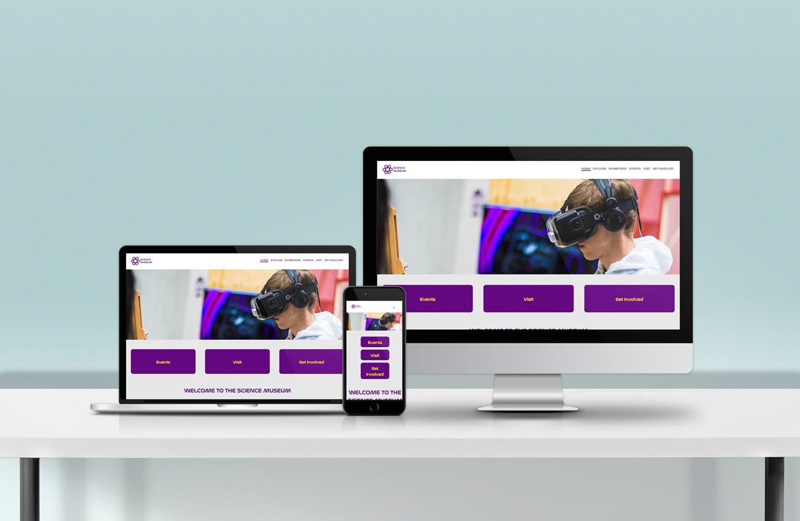

# Science Museum - Semester Project 1

<p align="center">
  
</p>

## Description

An interactive science museum called the Community Science Museum is opening in your town/city. <br/>
Its core target audience is primary and middle school children (7-15) and families with young children. <br/>
The museum wants a website that is informative and appealing, that will attract both middle school pupils and their parents. <br/>
The site should appeal to youngsters without pandering; it should take for granted that the audience is inquisitive and intelligent. <br/>
The website should be informative and engaging, but should encourage viewers to visit the museum itself. <br/>
The website should be responsive and be easy to use on a variety of devices.

### Project requirements

- The site must have a design that appeals to the target audience.
- The site must have at least 4-6 pages.
- Compositional principles, typography, and color schemes must be considered.
- Your HTML should be semantic and neatly indented.
- The site should use external CSS style sheets which follow the DRY principle.
- The site should download quickly, and not be overly "heavy". Images should not be over 200kb.
- The site should take WCAG principles into consideration, especially regarding hierarchy, navigation, and color usage.
- The site should be responsive, attractive, and easy to use on a variety of devices.
- The site should show consideration for content strategy and SEO (consider your use of meta tags and alt text).

## Built With


## Getting Started

### Installing

1. Clone the repo:

```bash
git clone git@github.com:KarolinaSzymanska899/Science-Museum.git
```

### Running

Using the liveServer extension for VScode:

Right click on the index.html and click view in live server. This will open [http://localhost:3000](http://localhost:3000) in your browser where you can see the result.

## Contact

[](https://www.linkedin.com/in/karolina-szyma%C5%84ska-64b36089/)
